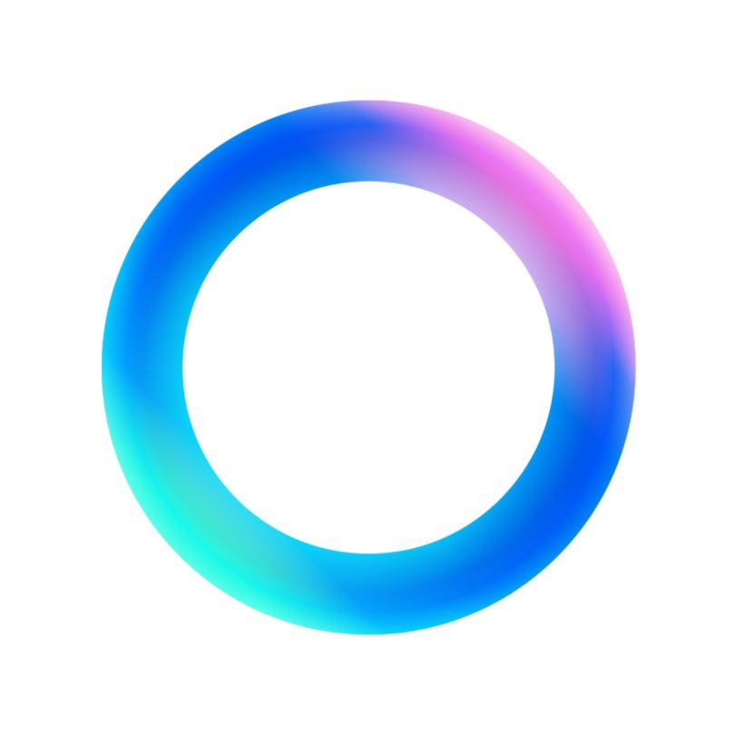

<h1 align = "center>

  </h1>
  <h5 align = "center"> 
    <code><a href="https://www.linkedin.com/in/ved-vyas-416631327/" title="LinkedIn Profile"> LinkedIn</a></code>
 <code><a href="https://www.hackerrank.com/profile/ved_codes2312" title="HackerRank Profile"> HackerRank</a></code>  
<code><a href="https://x.com/vedcodes2312" title="Twitter(X) Profile"> Twitter(X)</a></code> 
  <code><a href="https://www.quora.com/profile/Ved-Vyas-147" title="Quora Profile"> Quora</a></code>
    <code><a href="https://www.reddit.com/u/vedvyas2312/" title="Reddit Profile"> Reddit</a></code>
    <code><a href="https://www.pinterest.com/codewithved2312/" title="Pinterest Profile"> Pinterest</a></code>
     <code><a href="https://lovelearningconcepts.blogspot.com" title="Blogger Profile"> Blogger</a></code>
     <code><a href="https://instagram.com/vedcodes2312" title="instagram page"> Instagram</a></code>
      <code><a href="https://www.facebook.com/profile.php?id=61571205965583" title="fb page"> Facebook</a></code>
  </h5> 
 

👋 Hi, I’m Ved Vyas(GITHUB: @vedcodes2312), a rookie coder,a technology,maths and AI enthusiast from India.
 
 
 🎓 Engineering Undergraduate Student at GSFC University (Department of Computer Science and Engineering,School of Technology)
   
📗 A studious guy,a keen learner,love and always ready to learn new stuff
 
💻 I love coding,trying new tools,languages and other tech.
 
⌚ Dived into the multiverse of programming in 2024,having basic prior knowledge of HTML and Java from school days.
   
 📞📩 Contact and connect with me:
   
   E-Mail 1: <a href="mailto: codewithved2312@gmail.com">codewithved2312@gmail.com</a>
   
  E-Mail 2: <a href="mailto: workwithved2312@gmail.com">workwithved2312@gmail.com</a> 

<h2 align="center">🔥 Languages,Frameworks,Tools, Abilities and Other Softwares🔥</h2>
 

<code></code>
  <code></code>
<code></code>
 <code></code>
<code></code>
  <code></code>
  <code></code>
  <code></code>
<code></code>
<code></code>
<code></code>
 

<h2 align="center"> 📶 Statistics 📶 </h2>

   
  

 

 

 

 
 

 

<h2 align="center"> 💥 Repositories 💥 </h2>
 

 

      

      

<h4 align="center">
  <a href="https://github.com/vedcodes2312?tab=repositories" title="Show Repositories">🔎 See , search and explore more repositories </a>
</h4>

 
 
  

